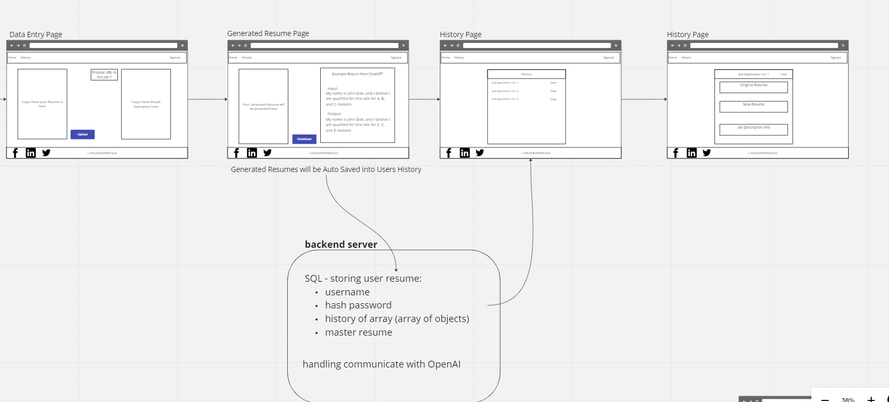

# Project Prep 4 - Requirements

## Vision

What is the vision of this product? - The vision of this products is to assist job-hunters when modifying their resumes for potentially dozens of job postings. We want to leverage the power of ChatGPT to accept resumes and modify them to more closely match a given description.

What pain point does this project solve? - This project solves the pain point of spending many hours applying for jobs that have drastically different language.

Why should we care about your product? - Because we're all about to be applying for jobs! I know 17 people who should be excited about this project.

## Scope (In/Out)

### IN - What will your product do

This web app will accept a resume upload from the user.

This web app will allow user's to enter either a job description that they want their resume to be tailored to.

Because this app will house user's data, it will be secured with RBAC/Auth0.

This app will allow user's to see every version of their resume generated by chatGPT so they can compare and contrast.

### OUT - What will your product not do.

This will be a web app NOT a mobile app. Mobile is not a good fit for such a text heavy application and developing for that platform beyond web responsive design would needlessly complicate our development.

### MVP and Stretch

### MVP

Minimum Viable Product - MVP will be essentially 3 text boxes. One for resume entry, one for job description entry, one for the updated resume. We will also need a functional connection to the openAI API.

### Stretch

What are your stretch goals? - Stretch goals are largely polish related. We want a resume PDF upload instead of text entry, and LinkedIn API integration instead of manual entry by the user.

## Functional Requirements

Users can enter their information (resume and job description).

Users can access all of their generated resumes

Users can edit the updated resume before storing it in our database.

## Data Flow

Users will be prompted to login on our splash page. They will submit credentials and they will be verified by our backend.

Our backend will send the verified credentials and a JWT to the client, where they will have a capabilities list for RBAC.

Users once logged in will submit their information (resume and description). This data will be passed to our backend.

Once at our backend the data will be groomed for API calls to openAI. We will pass the data along with our specific prompt.

We will handle the API response, groom the data, and send it to the client. Groomed resume will be saved to Postgres database.

Client will receive the groomed API response, reformat it and show it to the user.

## Non-Functional Requirements (301 & 401 only)

Non-functional requirements are requirements that are not directly related to the functionality of the application but still important to the app.

### Security

Security will be provided by Auth0 and RBAC layered on top of that service. RBAC will be used to disallow users from deleting data unless they are an admin. We will be routing all API traffic through our backend to avoid exposing our API keys to end users.

### Testability

Our approach to testability will be to use integration tests wherever possible and to fill the gaps with unit tests. We have chosen PostgreSQL to limit some testing concerns that arise with MongoDB. We will use TDD as a baseline, but that is not a hard contract we will hold ourselves to. Testing will be done with Jest on the backend and React Testing library on the frontend.

## User Stories

## UML

## Schema Design

